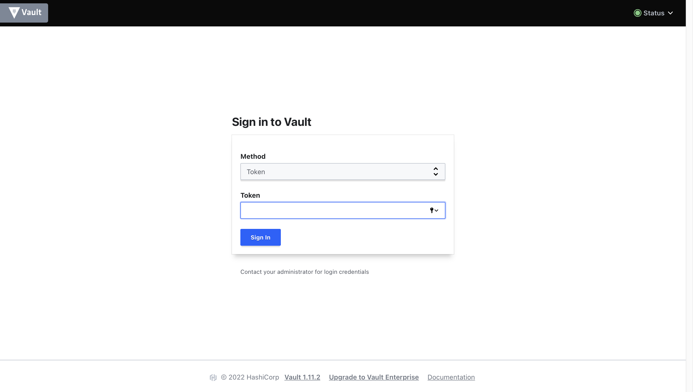

## Лабораторная работа №1 "Установка Docker и Minikube, мой первый манифест."
### Описание
Это первая лабораторная работа в которой вы сможете протестировать Docker, установить Minikube и развернуть свой первый "под".

### Цель работы
Ознакомиться с инструментами Minikube и Docker, развернуть свой первый "под".

### Правила по оформлению

Правила по оформлению отчета по лабораторной работе вы можете изучить по [ссылке](../reportdesign.md)

### Ход работы
Данную лабораторную работу рекомендуется начать с изучения [Документация по Minikube](https://minikube.sigs.k8s.io/docs/), эта статья поможет вам в первоначальном представлении о инструменте Minikube.

Перед выполнением лабораторной работы вам необходимо выполнить следующие задачи:

> Работу можно проводить на устройстве с архитектурой x86/arm64/ARMv7, [оригинальная инструкция](https://minikube.sigs.k8s.io/docs/start/)

- Установить Docker на рабочий компьютер

- Установить Minikube используя [оригинальную инструкцию](https://minikube.sigs.k8s.io/docs/start/)

- После установки вам необходимо развернуть minikube cluster
  
```bash
minikube start
```

- После запуска minikube cluster вы сможете взаимодействовать с k8s используя команду:
  
```bash
minikube kubectl
```

> Использование `minikube kubectl` необходимо если в вашей системе не был установлен `kubectl` (в инструкции по установке minikube это не предусмотрено), `kubectl` является инструментом по управлению обычного k8s кластера и устанавливается отдельно. Для удобства использования вы можете создать алиас `alias kubectl="minikube kubectl --"` или аналогичный на свое усмотрение, но это не обязательно. 

- Для первого манифеста мы выбрали образ HashiCorp Vault, более подробно можете почитать [тут](https://www.vaultproject.io). Вам нужно будет написать манифест для развертывания "пода" HashiCorp Vault, и при этом прокинуть внутрь порт **8200**

> ВАЖНО! Вам не надо самим собирать контейнер, вы можете его взять [тут](https://hub.docker.com/_/vault/)

- После этого вам необходимо будет создать сервис для доступа к этому контейнеру, самый просто вариант - это выполнить команду:
  
> Эта команда будет работать только если ваш "под" имеет имя `vault`

```bash
minikube kubectl -- expose pod vault --type=NodePort --port=8200
```

- Команда выше создаст сервис, но как же вам попасть на ваш контейнер? Воспользуйтесь следующей командой:

```bash
minikube kubectl -- port-forward service/vault 8200:8200
```

- minikube прокинет порт вашего компьютера в контейнер и вы сможете зайти в vault по ссылке [http://localhost:8200](http://localhost:8200)

- После перехода по ссылке у вас откроется интерфейс как на рисунке ниже



- Для успешного завершения лабораторной работы вам необходимо войти в ваш vault ипользуя токен, который вам необходимо НАЙТИ, а не сгенерировать. 

- Теперь вопросы на засыпку: 1. Что сейчас произошло и что сделали команды указанные ранее? 2. Где взять токен для входа в Vault? (**Подсказка: Логи всему голова**)

- Для остановки minikube cluster вы можете воспользоваться командой

```bash
minikube stop
```

### Результаты лабораторной работы
В результате данной работы у вас должно быть:

- Файл с разработанным вами минфестом для развертывания "пода" с расширением `.yaml`.

- Схема организации контейеров и сервисов нарисованная вами в [draw.io](https://app.diagrams.net) или Visio.

- Ответы на вопросы (по возможности), скриншоты c результатами работы.